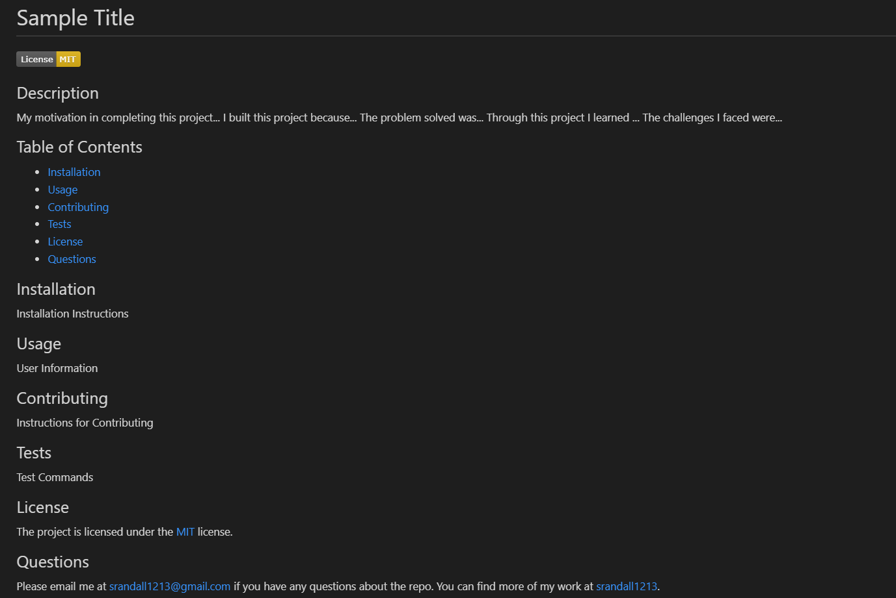

# README GENERATOR

## Description

My motivation in completing this project was to apply what I learned this week about Node.js. I built this project because I wanted to test my skills and see if I could be effective in creating a README.md Generator. The problem solved was the inconvenience of formatting a README.md. Through this project I learned more about node, inquirer prompts, fs.writeFile, and switch cases. I faced a couple small challenges with this project, but mostly I was figuring out how to work with the existing code to make it do what I was envisioning. 

## Sample Application Appearance

## Walkthrough Video Link
https://drive.google.com/file/d/1g9ejYrtvRkjCrlF1fqZGbL_pLsyi4kCK/view?usp=sharing
